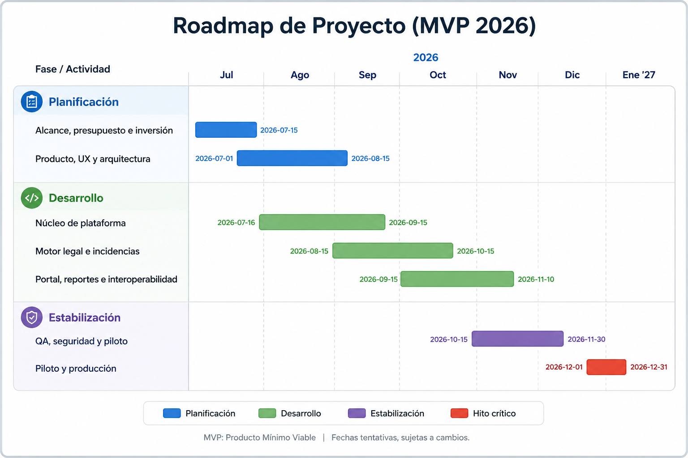

# RM-0001 - Roadmap de producto

## 1. Objetivo

Definir las fases de producto necesarias para construir el MVP de Jornada 360 antes de enero de 2027, manteniendo el alcance alineado con la investigación legal, el modelo de negocio y el presupuesto preliminar.

Este roadmap no cambia la fecha final del MVP. Organiza las capacidades dentro de las fases existentes para evitar que funciones relacionadas con alertas, conformidad digital y evidencia se traten como módulos nuevos.

## 2. Fecha objetivo

El MVP deberá estar operativo y listo para producción **a más tardar el 31 de diciembre de 2026**.

## 3. Fases del roadmap

Imagen de referencia:

| Fase | Periodo | Entregable principal |
|---|---|---|
| Alcance, presupuesto e inversión | 1-15 julio | Monto, alcance y acuerdo aprobados |
| Producto, UX y arquitectura | 1 julio-15 agosto | Flujos, prototipo, arquitectura domain-first y diseño técnico |
| Núcleo de plataforma | 16 julio-15 septiembre | Empresas, trabajadores, horarios, eventos y API P0 |
| Motor legal e incidencias | 15 agosto-15 octubre | Cálculos, alertas, correcciones y trazabilidad |
| Portal, reportes e interoperabilidad | 15 septiembre-10 noviembre | Portal, reportes, exportaciones, CSV y API |
| QA, seguridad y piloto | 15 octubre-30 noviembre | Versión candidata estable |
| Piloto y producción | 1-31 diciembre | MVP operativo antes de 2027 |

Las fases se traslapan deliberadamente para proteger la fecha final.

## 4. Alcance por fase

### 4.1 Alcance, presupuesto e inversión

Objetivo:

- Confirmar alcance MVP.
- Validar presupuesto preliminar.
- Definir estructura de inversión.
- Acordar criterios de salida para el MVP.

Entregables:

- `RM-0002-ALCANCE-Y-PRESUPUESTO-MVP.md`.
- Propuesta para socio inversionista.
- Lista de capacidades P0.

### 4.2 Producto, UX y arquitectura

Objetivo:

- Convertir la investigación legal y el modelo de negocio en flujos de producto.
- Definir arquitectura base, dominios y reglas de implementación.
- Definir arquitectura domain-first con exposición API-first bidireccional.
- Diseñar flujos críticos antes de construir.

Entregables:

- Flujos de registro de jornada.
- Flujos de incidencias, correcciones y conformidad digital.
- Flujo de revisión del reporte individual de cierre.
- Diseño técnico de motor legal, auditoría y evidencia.
- Definición de Actions/Services reutilizables para Livewire, API, CSV, jobs e integraciones.
- Priorización P0, P1 y fuera del MVP.

### 4.3 Núcleo de plataforma

Objetivo:

- Construir la base operativa del SaaS.
- Permitir que empresas, centros y personas trabajadoras puedan operar con datos aislados.
- Construir servicios de aplicación reutilizables desde el backend core.

Entregables:

- Multiempresa y aislamiento de datos.
- Usuarios, roles y permisos.
- Empresas, centros y personas trabajadoras.
- Condiciones laborales, horarios, turnos y vigencias.
- Registro electrónico de entrada, salida y pausas.
- Captura web responsiva/PWA y kiosco.
- Endpoints API P0 para trabajadores, eventos, jornadas, alertas, incidencias y reportes de periodo.
- Autenticación API con tokens y alcance por empresa.
- Idempotencia para creación de eventos y operaciones sensibles.

### 4.4 Motor legal e incidencias

Objetivo:

- Calcular jornadas y posibles desviaciones con base en reglas versionadas.
- Resolver incidencias sin destruir historial.
- Preparar los datos para reportes de cierre y revisión.

Entregables:

- Cálculo de jornadas diurnas, nocturnas y mixtas.
- Cálculo de límites diarios, semanales, horas extraordinarias y descansos.
- Detección automática de posibles incumplimientos.
- Clasificación por nivel de prioridad.
- Flujo de revisión, justificación y corrección.
- Incidencias, correcciones y aprobaciones.
- Trazabilidad entre evento, regla, resultado, alerta y resolución.

### 4.5 Portal, reportes e interoperabilidad

Objetivo:

- Dar transparencia a la persona trabajadora.
- Generar reportes útiles para operación, cierre de periodo y revisión.
- Permitir salida de información hacia nómina o sistemas externos.

Entregables:

- Portal de la persona trabajadora.
- Reporte individual de cierre de periodo.
- Revisión por la persona trabajadora.
- Estados de revisión: conforme, no conforme y pendiente.
- Solicitud de aclaración.
- Reportes operativos y regulatorios.
- Expediente exportable para autoridad.
- Importación CSV e interoperabilidad básica.
- Exportación básica hacia prenómina.

### 4.6 QA, seguridad y piloto

Objetivo:

- Verificar cálculos, seguridad, trazabilidad y flujos críticos antes del piloto.
- Validar que la evidencia no pueda alterarse de forma silenciosa.

Entregables:

- Casos de prueba legales automatizados.
- Pruebas de incidencias, correcciones y alertas.
- Versionamiento de reportes.
- Integridad mediante hash.
- Pruebas de corrección posterior a la conformidad.
- Pruebas de identidad y autenticación.
- Validación de que una firma anterior no se transfiera a una versión nueva.
- Seguridad, auditoría, respaldos y monitoreo.
- Versión candidata estable para piloto.

### 4.7 Piloto y producción

Objetivo:

- Operar el MVP con empresas piloto.
- Ajustar configuración, capacitación y soporte.
- Llegar a producción antes de enero de 2027.

Entregables:

- Implementación piloto.
- Capacitación a administradores, supervisores y personas trabajadoras.
- Soporte de salida.
- Reporte de resultados del piloto.
- MVP operativo antes de 2027.

## 5. Capacidades integradas sin cambio de fecha

Las siguientes capacidades quedan integradas en fases existentes y no modifican la fecha final:

| Capacidad | Fase responsable | Tratamiento |
|---|---|---|
| Alertas preventivas | Motor legal e incidencias | Parte del motor legal y del flujo de incidencias |
| Conformidad digital | Portal, reportes e interoperabilidad | Parte del portal y del reporte de cierre |
| Reporte individual de cierre | Portal, reportes e interoperabilidad | Parte de reportes MVP |
| Hash y versionamiento | QA, seguridad y piloto | Parte de auditoría, evidencia y pruebas |
| Corrección posterior a conformidad | QA, seguridad y piloto | Caso crítico de trazabilidad |
| Identidad y autenticación | QA, seguridad y piloto | Requisito mínimo de validez de revisión |

## 6. Dependencias documentales

- `docs/01-Legal/LEG-0001-LFT/09-Matriz-Trazabilidad.md`
- `docs/02-Negocio/NEG-0001-MODELO-DE-NEGOCIO.md`
- `docs/11-Roadmap/RM-0002-ALCANCE-Y-PRESUPUESTO-MVP.md`

## 7. Criterio de control de alcance

Una función permanece dentro del MVP si cumple al menos una de estas condiciones:

- Es necesaria para registrar jornada.
- Es necesaria para calcular resultados legales básicos.
- Es necesaria para corregir o justificar incidencias.
- Es necesaria para que la persona trabajadora revise su periodo.
- Es necesaria para conservar evidencia verificable.
- Es necesaria para operar el piloto antes de enero de 2027.

Toda función que no cumpla estos criterios deberá enviarse a una fase posterior.
